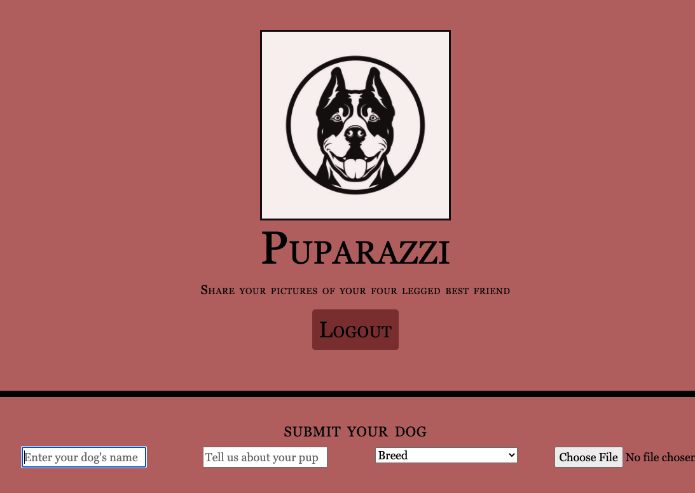
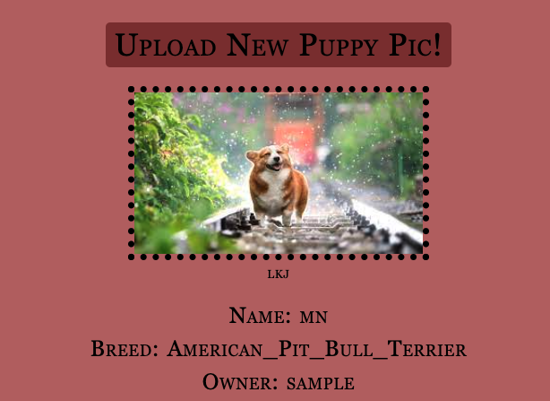
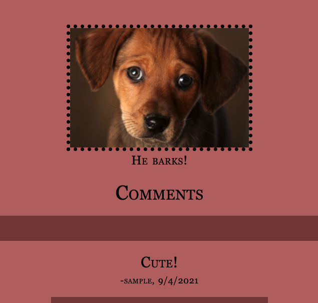

# project_2

## Description 

As dog ownership becomes more prevalent, coupled with the amount of people choosing pets over children, it's a no brainer that a social media app dedicated to sharing the images and stories of our fur friends is needed. With the ability to post about Petunia, brag about Bruiser, and comment about Cleo, this app will allow paw parents to share photos and create lasting memories for their pet and it’s adoring fans online. 

Pup-a-razzi is a social media application just for dogs! Users are able to create an account, share photos, and comment on posts. In the future, users will be able to like posts, upload videos, and much more.

## Table of Contents 

* [Contributors](#contributors)
* [Languages](#languages)
* [License](#license)
* [Documentation](#documentation)

## Contributors

[Seth Marks](https://github.com/Sethmarks216)
[Ryan Tuttle](https://github.com/rtuttle93)
[Logan Dufek](https://github.com/LoganDufek)
[Max Fausnight](https://github.com/fausnightm)

   
## Languages

HTML, CSS, SQL, Javascript

### Additional Packages, Templates, etc.

Node and Express were used to create a RESTful API. Handlbars.js was used as our template engine. MySQL and Sequelize were used for the database. Cloudinary stores user images.

Be sure to install all relevant packages if you wish to explore our application locally.

## License

MIT License

Permission is hereby granted, free of charge, to any person obtaining a copy
of this software and associated documentation files (the "Software"), to deal
in the Software without restriction, including without limitation the rights
to use, copy, modify, merge, publish, distribute, sublicense, and/or sell
copies of the Software, and to permit persons to whom the Software is
furnished to do so, subject to the following conditions:

The above copyright notice and this permission notice shall be included in all
copies or substantial portions of the Software.

THE SOFTWARE IS PROVIDED "AS IS", WITHOUT WARRANTY OF ANY KIND, EXPRESS OR
IMPLIED, INCLUDING BUT NOT LIMITED TO THE WARRANTIES OF MERCHANTABILITY,
FITNESS FOR A PARTICULAR PURPOSE AND NONINFRINGEMENT. IN NO EVENT SHALL THE
AUTHORS OR COPYRIGHT HOLDERS BE LIABLE FOR ANY CLAIM, DAMAGES OR OTHER
LIABILITY, WHETHER IN AN ACTION OF CONTRACT, TORT OR OTHERWISE, ARISING FROM,
OUT OF OR IN CONNECTION WITH THE SOFTWARE OR THE USE OR OTHER DEALINGS IN THE
SOFTWARE.

## Documentation

Live Deployed Application (Heroku): [View Application](https://dry-fjord-30943.herokuapp.com/)   

Here are some examples of what your experience will look like!

This is the web page for uploading posts.

      

Once the photo is uploaded you can view it in a feed.

   

Anyone who has an account can comment on any post they like!

   

